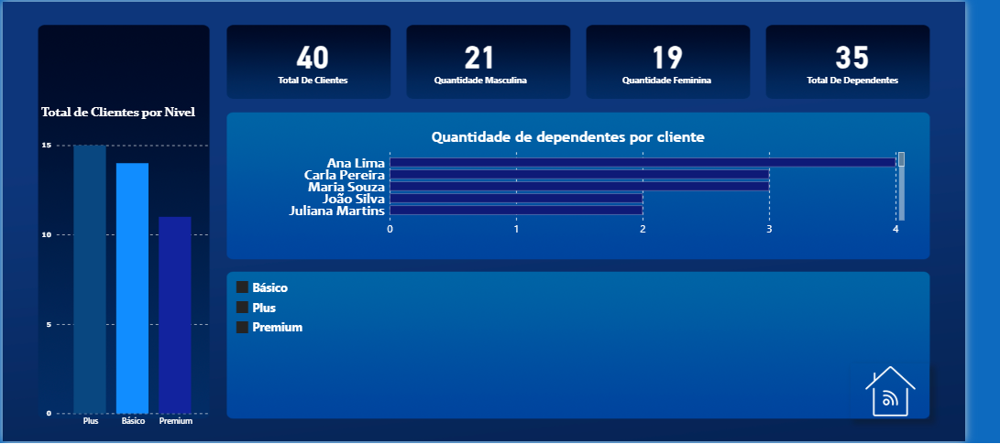

# 📊 Dashboard – Clube de Associados (Power BI)

## 📌 Visão Geral
Este projeto consiste em um **dashboard interativo desenvolvido no Power BI** para análise da base de clientes de uma empresa fictícia (Clube de Associados).

O objetivo é visualizar e explorar dados de clientes, segmentando por **gênero**, **nível de serviço** e **quantidade de dependentes**, facilitando análises gerenciais e a tomada de decisão.

---

## 🎯 Objetivo do Dashboard
- Analisar a distribuição de clientes por nível de serviço (Básico, Plus e Premium)
- Comparar a quantidade de clientes por gênero
- Avaliar a quantidade de dependentes por cliente
- Fornecer uma visão rápida e clara através de indicadores (KPIs)

---

## 📈 Principais Indicadores (KPIs)
- Total de Clientes
- Quantidade de Clientes Masculinos
- Quantidade de Clientes Femininos
- Total de Dependentes

---

## 📊 Visualizações Criadas
- Gráfico de barras: Total de clientes por nível de serviço
- Gráfico de barras horizontais: Quantidade de dependentes por cliente
- Cartões de indicadores (KPIs) para visão geral
- Segmentações interativas para facilitar a exploração dos dados

---

## 🛠️ Ferramentas Utilizadas
- Power BI Desktop
- Modelagem de dados
- Criação de medidas e indicadores
- Visualizações interativas

---

## 🗂️ Arquivo do Projeto
- `Dashboard_Clube_Associados.pbix`

> Para visualizar o dashboard, é necessário ter o **Power BI Desktop** instalado.

---

## 📌 Observação
Este projeto utiliza **dados fictícios**, criados exclusivamente para fins de **estudo e portfólio**.

---

## 👤 Autor
**Kauã Muniz**  
Estudante de Ciência Da Computação 
Interesse em **Dados, BI e Analytics**

## 📷 Preview do Dashboard

